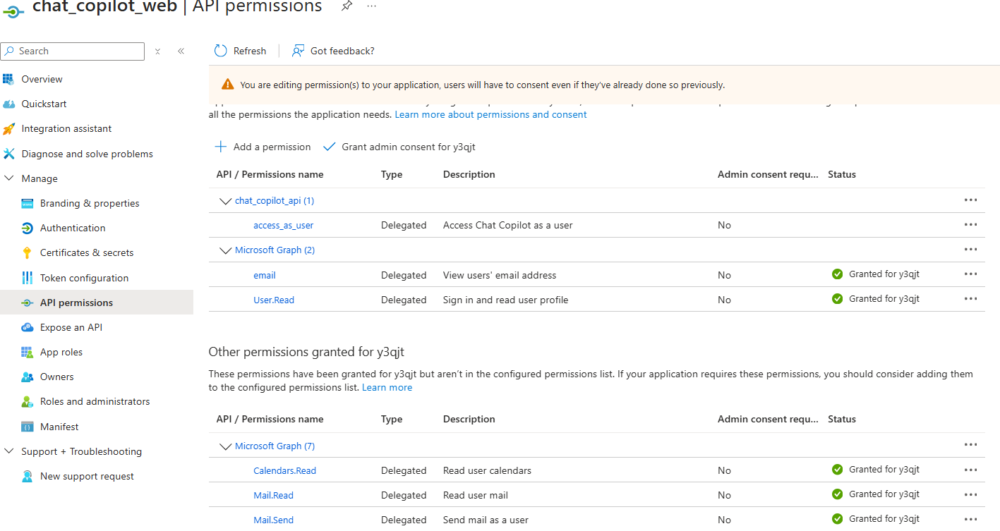

# Azure App Permission

An application can have API permission show on the portal as below.


## Example App 

Name: `chat_copilot_web` 

```bash
az ad app show --id "$AZURE_CLIENT_ID" > az_ad_app_show.json
display_name=$(jq -r '.displayName' az_ad_app_show.json)
az ad sp list --display-name "$display_name" > az_ad_sp_list.json
sp_id=$(jq -r '.[0].id' az_ad_sp_list.json)
az ad app permission list --id "$AZURE_CLIENT_ID" > az_ad_app_permission_list.json
az ad app permission list-grants --id "$AZURE_CLIENT_ID" > az_ad_app_permission_list_grants.json
az role assignment list --assignee "$sp_id" --all --include-groups --include-inherited > az_role_assignment_list.json

az rest --method get --url "https://graph.microsoft.com/v1.0/servicePrincipals/$sp_id/appRoleAssignments" > az_rest_app_role_assignments.json
az rest --method get --url "https://graph.microsoft.com/v1.0/servicePrincipals/$sp_id/appRoleAssignedTo" > az_rest_app_role_assigned_to.json
az rest --method get --url "https://graph.microsoft.com/v1.0/servicePrincipals/$sp_id/oauth2PermissionGrants" > az_rest_oauth2_permission_grants.json
az rest --method get --url "https://graph.microsoft.com/v1.0/roleManagement/directory/roleAssignments" > az_rest_role_assignments.json
query="\$filter=principalId eq '$sp_id'"
az rest --method get --headers "ConsistencyLevel=eventual" --url "https://graph.microsoft.com/beta/rolemanagement/directory/transitiveRoleAssignments?$query" > az_rest_transitive_role_assignments.json


az ad sp list --filter "displayName eq 'Microsoft Graph'" --query '[].oauth2PermissionScopes[].{Value:value, Id:id, UserConsentDisplayName:userConsentDisplayName}' > az_ad_sp_list_msgraph_oauth2_permission_scopes.json
```

Configured permissions can be queried with `az ad app permission list` see [List API permissions the application has requested.](https://learn.microsoft.com/en-us/cli/azure/ad/app/permission?view=azure-cli-latest#az-ad-app-permission-list)
```json
[
  {
    "resourceAccess": [
      {
        "id": "64a6cdd6-aab1-4aaf-94b8-3cc8405e90d0",
        "type": "Scope"
      },
      {
        "id": "e1fe6dd8-ba31-4d61-89e7-88639da4683d",
        "type": "Scope"
      }
    ],
    "resourceAppId": "00000003-0000-0000-c000-000000000000"
  },
  {
    "resourceAccess": [
      {
        "id": "49312766-d42f-45fc-8331-ad03686ab94b",
        "type": "Scope"
      }
    ],
    "resourceAppId": "872fdde2-d3ef-4c2a-8594-453d6df2571c"
  }
]
```

Other permissions granted (delegated permissions) can be queried with `az ad app permission list-grants`
```json
[
  {
    "clientId": "c59dbf4d-cef2-4373-bcbe-6140e6f08a9e",
    "consentType": "AllPrincipals",
    "id": "Tb-dxfLOc0O8vmFA5vCKnmik1TEuhaFKjhxpp_mqtqM",
    "principalId": null,
    "resourceId": "31d5a468-852e-4aa1-8e1c-69a7f9aab6a3",
    "scope": " openid profile email Calendars.Read Mail.Read Mail.Send Tasks.ReadWrite User.Read offline_access"
  }
]
```

```bash
[ -f .env ] && while IFS= read -r line; do [[ $line =~ ^[^#]*= ]] && eval "export $line"; done < .env

# You must login as a global administrator. to see admin-consent settings
az login --use-device-code --tenant "$AZURE_TENANT_ID"

./permission_audit.sh
```


# References
* Audit Apps and Consented Permissions https://learn.microsoft.com/en-us/azure/security/fundamentals/steps-secure-identity#audit-apps-and-consented-permissions
* Review and audit permissions https://learn.microsoft.com/en-us/defender-office-365/detect-and-remediate-illicit-consent-grants
* Locate risky or unwanted OAUuth applications https://learn.microsoft.com/en-us/defender-cloud-apps/investigate-risky-oauth
* List Service Principal appRoleAssignments https://learn.microsoft.com/en-us/graph/api/serviceprincipal-list-approleassignments?view=graph-rest-1.0&tabs=http
* List Service Principal granted appRoleAssignments https://learn.microsoft.com/en-us/graph/api/serviceprincipal-list-approleassignedto?view=graph-rest-1.0&tabs=http
* List Service Principal delegated permissions https://learn.microsoft.com/en-us/graph/api/serviceprincipal-list-delegatedpermissionclassifications?view=graph-rest-1.0&tabs=http
* List Service Principal oauth2PermissionGrants https://learn.microsoft.com/en-us/graph/api/serviceprincipal-list-oauth2permissiongrants?view=graph-rest-1.0&tabs=http
* List Service Principal membership groups https://learn.microsoft.com/en-us/graph/api/serviceprincipal-list-memberof?view=graph-rest-1.0&tabs=http
* List Service Principal transitive memberOf https://learn.microsoft.com/en-us/graph/api/serviceprincipal-list-transitivememberof?view=graph-rest-1.0&tabs=http
* List Service Principal owners https://learn.microsoft.com/en-us/graph/api/serviceprincipal-list-owners?view=graph-rest-1.0&tabs=http
* Monitor for application admin consent https://ourcloudnetwork.com/how-to-monitor-for-application-admin-permission-consent-in-azuread/